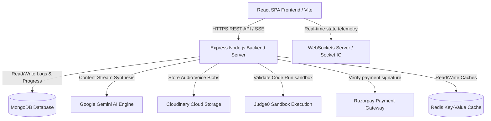

# InterviewAI Pro — AI-Powered Technical & HR Preparation SaaS

InterviewAI Pro is an advanced, enterprise-grade SaaS platform designed to streamline tech and HR recruitment interview readiness. By combining real-time verbal transcriptions, code sandbox runtimes, resume tailoring, and streaming AI guidance, candidates get a highly realistic mock-evaluation workflow.

---

## Technical Architecture



---

## Features Matrix

- **Interactive AI Mock Interviews**: Dynamic Question-Answer verbal rounds tracking confidence, technical vocabulary, and delivery fluency. Includes full audio voice recordings uploading and replay features.
- **ATS Resume Analyzer**: PDF parser matches upload coordinates against target Job Descriptions, returning instant visual metric match percentages and improvement feedback.
- **AI Career Coach Chatbot**: Real-time markdown chunk streaming (SSE) with interactive keyword search logs and conversation histories.
- **Code Execution Sandbox**: Web IDE runner powered by Judge0 execution endpoints for coding problems (e.g. Two Sum).
- **Recruiter & Admin Portals**: Invites sending, candidate statistics logs, and auto-generated PDF evaluation report cards.

---

## Technology Stack

- **Frontend Core**: React 18, Vite, TailwindCSS / HSL Custom Styling, Framer Motion (premium micro-animations), Lucide Icons.
- **Backend Core**: Node.js, Express, Helmet, CORS, Rate-Limiting rules, Winston Logger.
- **AI Integrations**: `@google/genai` (Gemini API integration).
- **Cache & Telemetry**: Redis cache clusters, Socket.IO WebSockets, Prometheus HTTP exporter metrics.
- **Payment & Mail**: Razorpay Checkout integration, Resend onboarding notifications mailer.

---

## Directory Structure

```
├── .github/workflows/   # CI/CD pipelines
├── client/              # React SPA Single Page Application codebase
│   ├── src/             # Components, contexts, pages, styles
│   └── vercel.json      # Client production URL routing rewrite config
└── server/              # Express REST API codebase
    ├── src/             # Controllers, models, routes, services
    └── Dockerfile       # Node web service build config
```

---

## Getting Started

### Local Installation

1. **Clone the Repository**:
   ```bash
   git clone https://github.com/yourusername/interviewai-pro.git
   cd interviewai-pro
   ```

2. **Configure Environment variables**:
   Create a `.env` file inside `server/` using the instructions provided in `.env.example`.

3. **Install Dependencies**:
   ```bash
   # Root orchestration
   npm install
   npm install --prefix client
   npm install --prefix server
   ```

4. **Launch Application**:
   ```bash
   npm run dev
   ```
   The client compiles Vite assets at `http://localhost:5173/` and backend listens on `http://localhost:5000/`.

---

## Deployment Guide

### React Frontend on Vercel
Deploy the `/client` directory, specifying `npm run build` as the compile command and `dist` as the target directory. Ensure `VITE_API_URL` is set to your active Render backend API URL.

### Express Backend on Render
Create a Web Service from the `/server` directory. Bind environment keys for MongoDB Atlas and your Gemini API Keys. Configured health check path is `/health`.

---

## License
Licensed under the [MIT License](LICENSE).
